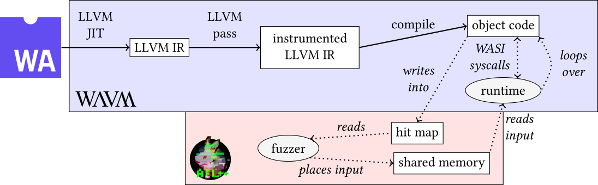

[](LICENSE.txt)
[](paper.pdf)
[](WAFL@ROOTS21.pdf)
[](https://doi.org/10.1145/3503921.3503924)

# WAFL

Source code for the WASI fuzzer presented in "WAFL: Binary-Only WebAssembly Fuzzing with Fast Snapshots",
based on [WAVM](https://github.com/WAVM/WAVM) and [AFL++](https://github.com/AFLplusplus/AFLplusplus).



## Building

You'll need Clang, CMake and Git, plus the Zlib and LLVM development libraries.
```
sudo apt install clang cmake git llvm-dev zlib1g-dev
```
Then, clone this repository including its AFL++ submodule and compile AFL++.
```
git clone https://github.com/fgsect/WAFL
cd WAFL
git submodule update --init
cd AFLplusplus
make WAFL_MODE=1 TEST_MMAP=1
```
Next, we'll compile the WAVM part.
```
mkdir ../build && cd ../build
ln -s ../AFLplusplus/afl-llvm-pass.so
ln -s ../AFLplusplus/libLLVMInsTrim.so
cmake .. -DCMAKE_BUILD_TYPE=Release
make wavm -j8
```
Done! You can now start fuzzing.

## Usage

Prior to fuzzing, you need to create an input directory with at least one
non-empty file. Then run AFL:
```
AFL_SKIP_BIN_CHECK=1 ./afl-fuzz -i <INDIR> -o <OUTDIR> ../build/bin/wavm run <WASM FILE>
```
You may get error messages depending on your OS;
for testing purposes, you can safely override them using
`AFL_I_DONT_CARE_ABOUT_MISSING_CRASHES=1` and / or `AFL_SKIP_CPUFREQ=1`.

**Note:** Additionally you should always enable snapshots, they increase
performance considerably!

### Configuration options

Some aspects of WAFL can be controlled using environment variables.

|                     | Environment Variable | Options                         |
|---------------------|----------------------|---------------------------------|
| Snapshot & Reset    | `__AFL_PERSISTENT`   | `0` (default) or `1`            |
| Shared Mem. Input   | `__AFL_SHM_FUZZ`     | `0` (default) or `1`            |
| Allowlist           | `AFL_LLVM_ALLOWLIST` | Path to allowlist               |
| Denylist            | `AFL_LLVM_DENYLIST`  | Path to denylist (e.g. [wasi-blocklist.txt](wasi-blocklist.txt)) |
| Instrumentation     | `AFL_LLVM_INSTRUMENT`| `classic`, `cfg`, `native` (default), `none` |
| Context / N-Gram[^1]| `AFL_LLVM_INSTRUMENT`| `ctx`, `ngram-x` (x in [2..16]) |

[^1]: Must be combined with Classic or CFG instrumentation
(separate multiple options with `,`).

### Precompilation

WAVM provides us with an option to separate compilation (and instrumentation)
from execution. This can be useful for large binaries.
The Allow-/Denylist and Instrumentation (incl. Context / N-Gram) environment
variables shown above can be applied here.
```
../build/bin/wavm compile <WASM FILE> <COMPILED>
```
Afterwards, fuzz the precompiled binary and turn off instrumentation:
```
AFL_LLVM_INSTRUMENT=none AFL_SKIP_BIN_CHECK=1 ./afl-fuzz -i <INDIR> -o <OUTDIR> ../build/bin/wavm run --precompiled <COMPILED>
```

### License

WAVM is available under a [3-Clause BSD](LICENSE.txt) license and uses
third-party software under [various licenses](THIRD-PARTY.md).
WAFL components based on AFL++ (files in `Lib/wavm-afl` and `Include/WAVM/wavm-afl`) are licensed under the [Apache License 2.0](https://github.com/AFLplusplus/AFLplusplus/blob/stable/LICENSE).
